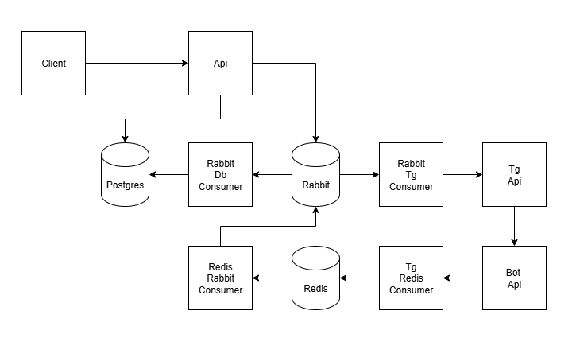

## Usage:
- Run `pip install Telethon`
- Fill your number in `make_tg_session` and run script
- Create main `.env` using `.env.example`
- Create virus `.env` 
- Follow `Makefile` to build and up everything
- Execute `python run_api_client.py` to check how it works
